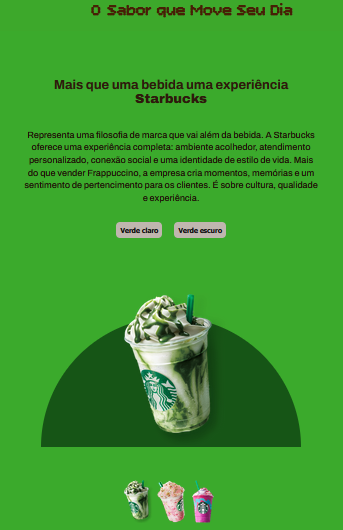

<h1 align="center"> Starbucks #Mais do que uma bebida </h1>

Mais que um site, uma experiência.

  <a href="#-tecnologias">Tecnologias</a>&nbsp;&nbsp;&nbsp;|&nbsp;&nbsp;&nbsp;
  <a href="#-projeto">Projeto</a>&nbsp;&nbsp;&nbsp;|&nbsp;&nbsp;&nbsp;
  

  

 

  

## 🚀 Tecnologias

Esse projeto foi desenvolvido com as seguintes tecnologias:

- HTML e CSS
- JavaScript

## 💻 Projeto

Projeto desenvolvido durante o curso DevClub, inicialmente sem responsividade. Posteriormente, recriado e adaptado por iniciativa própria para garantir uma melhor experiência em dispositivos móveis.

## 🔖 Licença

Esse projeto está sob a licença MIT....